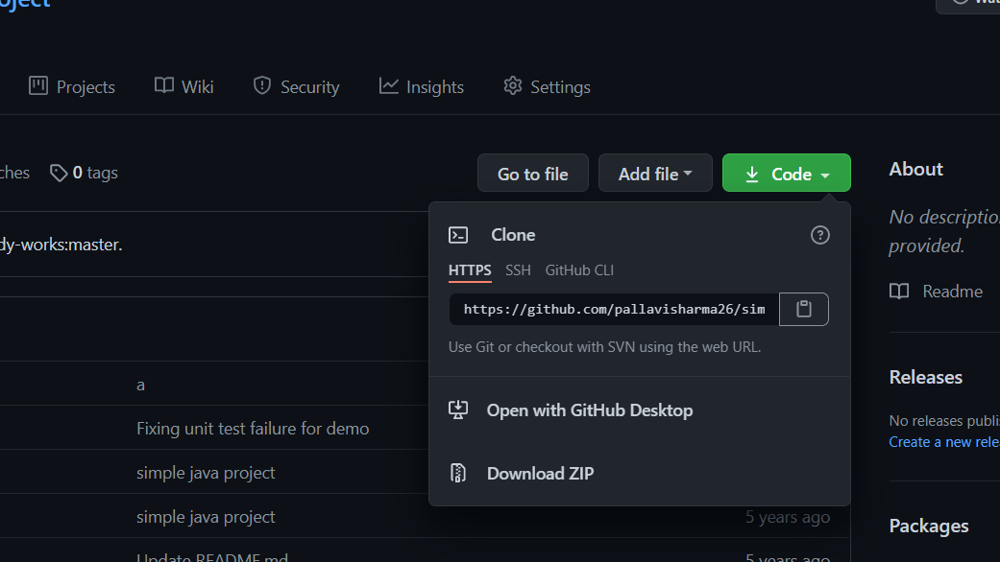
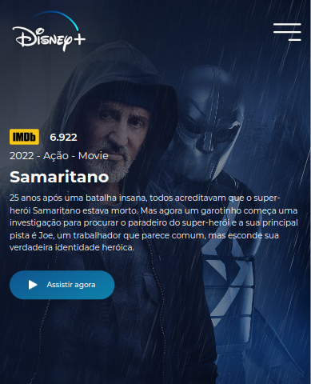
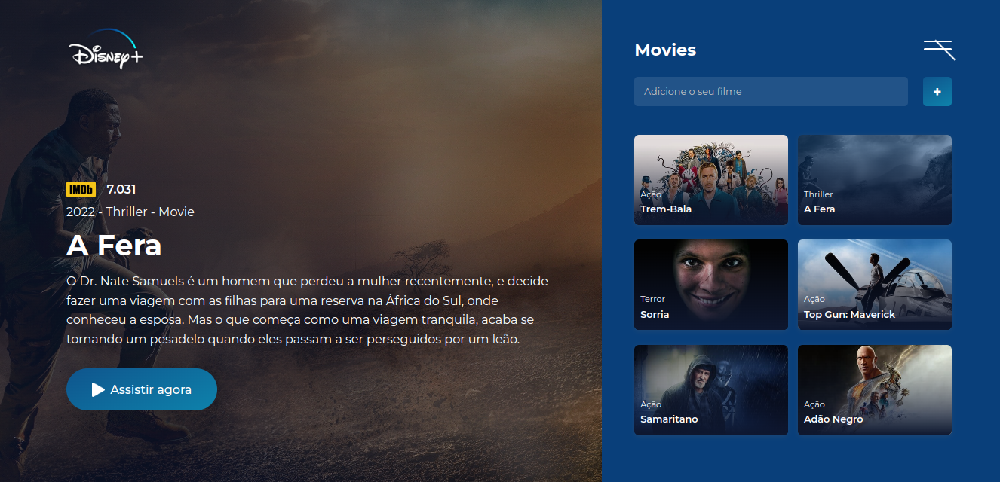

# Disney Plus + 

O propósito desse projeto foi clonar a interface do  **Disney Plus** usando tecnologias front-end.  
Para fins de fixação de aprendizado.

----

## 🛠️ Construído com

    
    
    
    

 

* [HTML](https://developer.mozilla.org/pt-BR/docs/Web/HTML) - Nossa linguagem de marcação de texto.
* [CSS](https://developer.mozilla.org/pt-BR/docs/Web/CSS) - Gerente de estilização da página.
* [JavaScript](https://developer.mozilla.org/pt-BR/docs/Web/JavaScript) - Usada para gerar Requisições e efeitos no projeto.
* [API](https://www.techtudo.com.br/listas/2020/06/o-que-e-api-e-para-que-serve-cinco-perguntas-e-respostas.ghtml) - Usada para gerar Requisições de materiais visuais ou os filmes e suas descrições.
  
----

## 🔧 Instalação

Para usar essa aplicação em sua maquina é só clonar por linha de comando ou fazer o download, e executar em documento _index.html_  
Ex:

    

---
 

## 🎁 Formatos da Aplicação

Formato mobile da página.

    

 

Formato web da página.

    

---

⌨️ com ❤️ by [ivan da cruz](https://gist.github.com/ivandacruz) 😊

